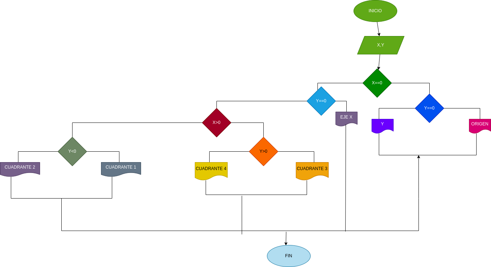

# EJERCICIO NO.1

## lea las coordenadas (x,y) de un punto en el plano, y calcular el cuadrante al cual pertenece el punto, si el punto esta sobre un eje tambien debe indicarlo 

# ANALISI

variables de entrada (input)

x= valor de la coordenada
y= valor de la coordenada 

variables de proceso y salida (processing, storange, output)

origen
eje x
eje y 
cuadrante 1
cuadrante 2 
cuadrante 3
cuadrante 4

# DISEÑO 

