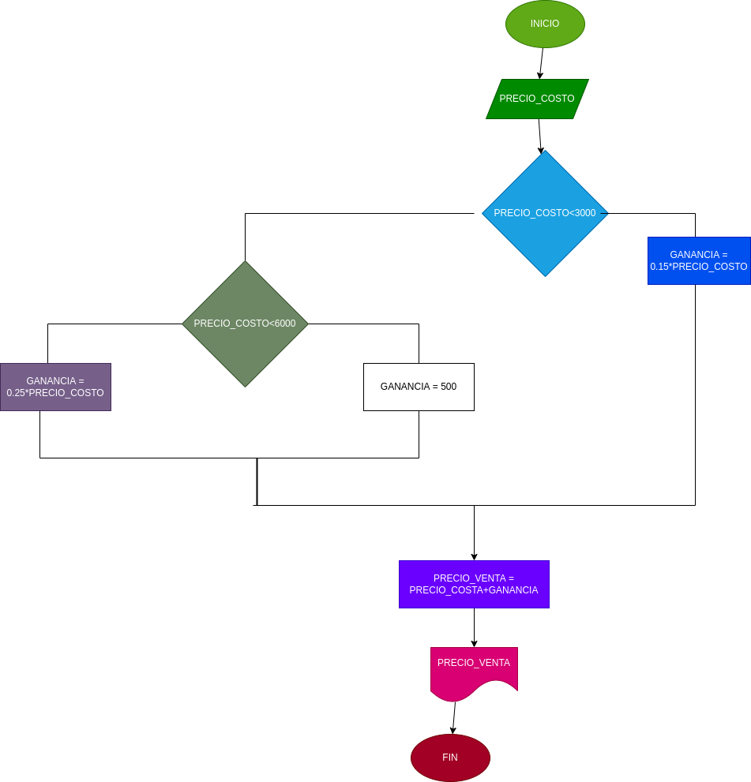

# EJERCIO NO.3

## precio para saber las ganancias de un producto

variables de entrada

PRECIO_COSTO = precio del producto que compramos

varibles de proceso 

GANANCIA = es el precio del costo por el pocetanje necesario de acuerdo al precio 
PRECIO_VENTA = (GANANCAIA + PRECIO_VENTA)

variables de salida 

PRECIO_VENTA = es el precio optimo de la venta del producto

# DISEÑO

# CONSTRUCCION