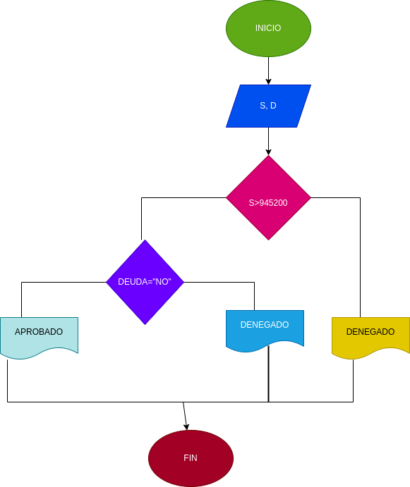

# EJERCICIO NO.2

## programa para adquirir un prestamo segun su salario y si tiene deudas anteriores

# ANALISIS

variables de entreada

salario = dinero necesario para adquirir el prestamos
deuda = saber si tiene deudas anteriores

variables de proceso

salario >= numero ingresado
deuda = si o no tiene deudas

variables de salida

aceptado = su prestamo fue aceptado
denegado = su prestamo fue denegado

nos indicara si se aceptara o no el prestamo

# DISEÑO

# CONSTRUCCION 